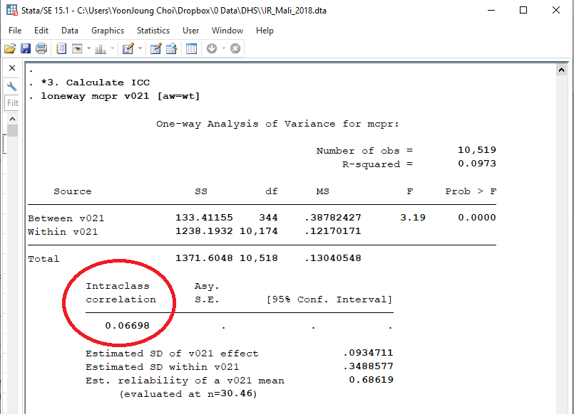
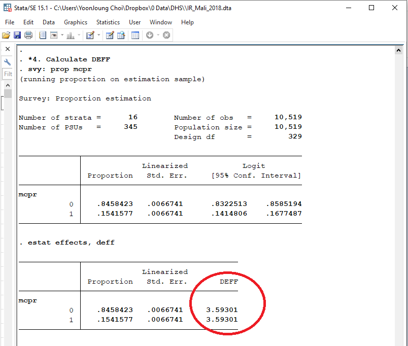

---
output:
  html_document:
    toc: true
    toc_depth: 5
    toc_float: true
---
```{r intro, echo=FALSE, results="hide"}
knitr::opts_chunk$set(echo=FALSE, 
                      message=FALSE, 
                      comment = "", 
                      warning=FALSE, 
                      results="hide") 
date<-as.Date(Sys.time(	), format='%d%b%Y')
setwd("C:/Users/YoonJoung Choi/Dropbox/0 Project/Shiny_DesignEffect")

#library(dplyr)
#library(ggplot2)
suppressMessages(library(dplyr, warn.conflict = FALSE, quietly = TRUE))
suppressMessages(library(ggplot2, warn.conflict = FALSE, quietly = TRUE))

```

__Intracluster correlation and design effect: How do we calculate them, and what do they look like?__   

_Illustrative example using Demographic and Health Surveys_

#### 1. Introduction 

Simple random sample (SRS) is rarely possible, and [cluster sampling](https://en.wikipedia.org/wiki/Cluster_sampling) is an approach balancing real world feasibility and desired precision from an unbiased sample. While operationally and statistically smart, a downside of this approach is that:  
- our sampled units tend to form similarities in each group (i.e., underlying similarity of individuals within cluster, [__Intraclass Correlation (ICC)__](https://en.wikipedia.org/wiki/Intraclass_correlation), increases)     
- variance in our sample decreases, and  
- we lose precision in our survey estimates.   

For example, even if we sample 300 students based on cluster sampling, statistical variance among the 300 students may be same with variance in a SRS of 100 students. This relative inefficiency in sample size in cluster sample compared to SRS (or relative inflation of sample size in cluster sample that will give same precision with that from SRS) is design effect. 

It is important to know ICC and design effect for both those who conducted a survey and those who design a new survey:   
- To understand effective sample size (and, thus, actual precision achieved) in completed surveys, and   
- To estimate design effect and determine sample size in a new survey, like in this [example](https://yj-choi.shinyapps.io/Shiny_DesignEffect/). 

Using data from [Demographic and Health Surveys](www.dhsprogram.com), this markdown demonstrates: how to calculate ICC and design effect; and distribution of ICC and design effect observed in multiple countries. 

#### 2. How do we calculate ICC and DEFF?  

First, we need the following variables: 

* v005: women's individual sample weight  
* v021: primary sampling unit (PSU) - sampling cluster   
* v022: sample strata, and, of course
* metric of main interest: we use __modern contraceptive prevalence rate (MCPR)__ (i.e., percentage of 15-49 year old women who currently use modern contraceptive methods) as an example primary indicator. 

In __Stata__ (_sorry, until I figure out correct R code. I'd welcome any suggestions..._), open an individual recode file (aka women's datafile) from your study country, and run the following code. Figures 1 and 2 show estimated ICC and design effect to measure MCPR, respectively, in Mali DHS 2018.  
```
    *1.Create or define the primary indicator 
    gen mcpr =v313==3
    	
    *2.Declare survey design for the dataset
    gen wt=v005/1000000
    svyset v021  [pw=wt], str(v022) singleunit(centered)
    	
    *3. Calculate ICC	
    loneway mcpr v021 [aw=wt]
    
    *4. Calculate DEFF
    svy: prop mcpr
    estat effects, deff	
```	
 
__Figure 1. Estimated ICC for modern contraceptive use among women 15-49 years of age, Mali 2018 DHS__ 
```{r StataOutput_ICC, results='asis', fig.align="left", fig.width=6, out.width = "600px"}

```

__Figure 2. Estimated design effect for modern contraceptive use among women 15-49 years of age, Mali 2018 DHS__ 
```{r StataOutput_DEFF, results='asis', fig.align="left", fig.width=6, out.width = "600px"}

```

#### 3. What are distributions of ICC and DEFF?  

Using the latest surveys from 60 countries, ICC and DEFF for MCPR were estimated. 


##### Distribution of estimated ICC for MCPR
```{r distribution_ICC, results='asis'}
dta <- read.csv("ICCfromDHS.csv")%>%
    filter(indicator=="% women using modern contraceptives")

ggplot(dta, aes(x=icc)) +
    geom_histogram(binwidth = 0.01,
                   aes(y=..density..),
                   color="gray", fill="white") +
    geom_vline(aes(xintercept=mean(icc)),
            color="blue", size=1) +
    xlim(0, 0.4) + 
    xlab("Intraclass correlation")
```

##### Distribution of estimated design effect for MCPR 
```{r distribution_DEFF, results='asis'}
ggplot(dta, aes(x=deff)) +
    geom_histogram(binwidth = 0.5,
                   aes(y=..density..),
                   color="gray", fill="white") +
    geom_vline(aes(xintercept=mean(deff)),
            color="blue", size=1) +
    xlim(0, 10) + 
    xlab("Design Effect")
```

* See, [GitHub](https://github.com/yoonjoung/Shiny_DesignEffect") for more information.  
* Last updated on: `r date`  
* For typos, errors, and questions: [contact me](https://www.isquared.global/YJ")  


